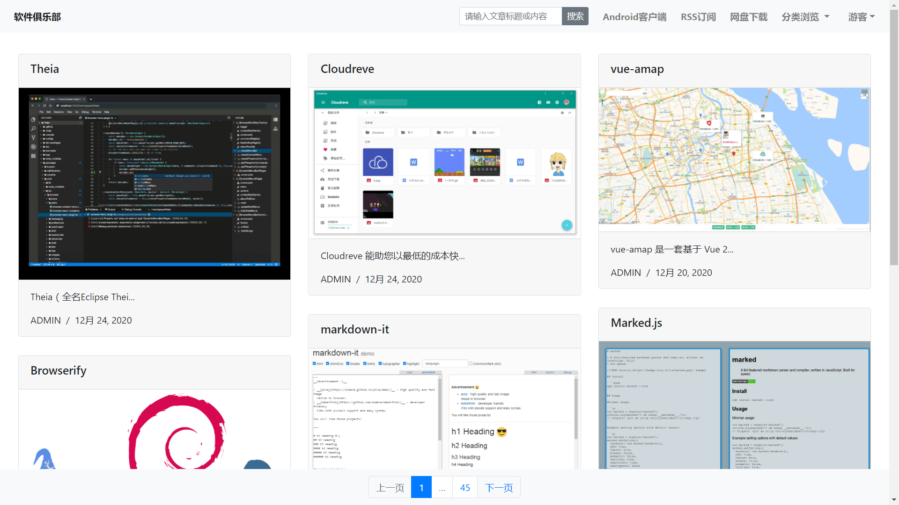
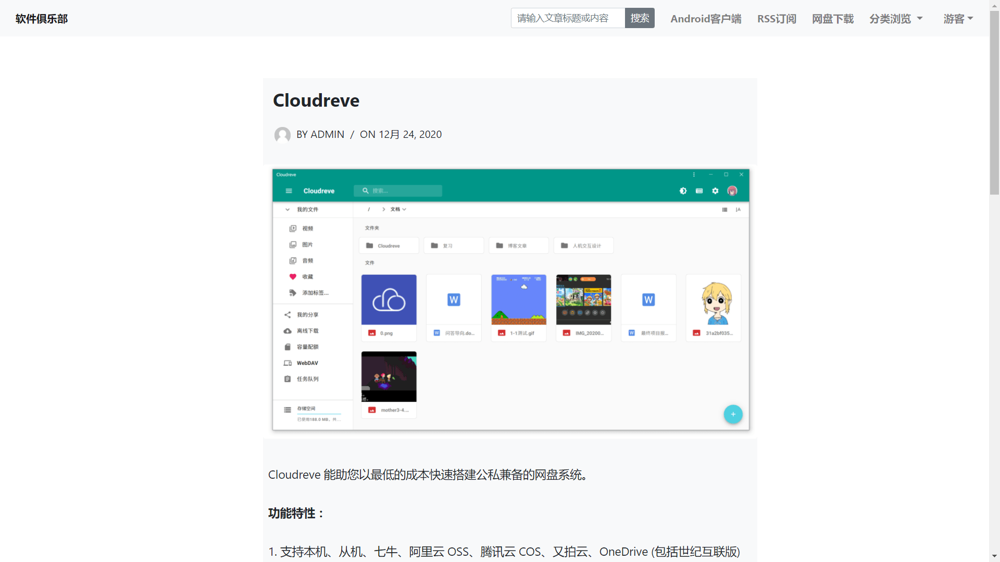
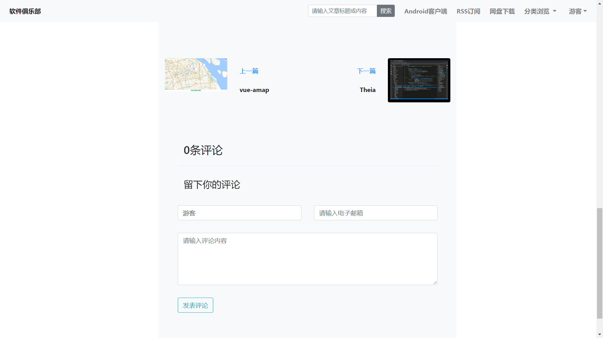
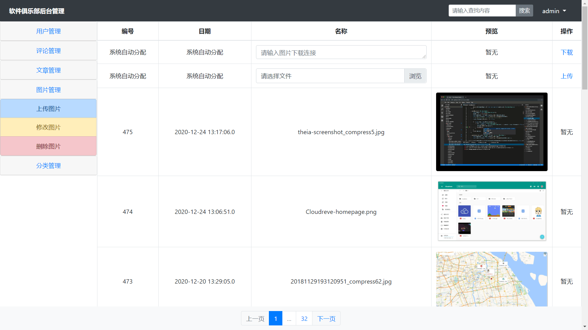
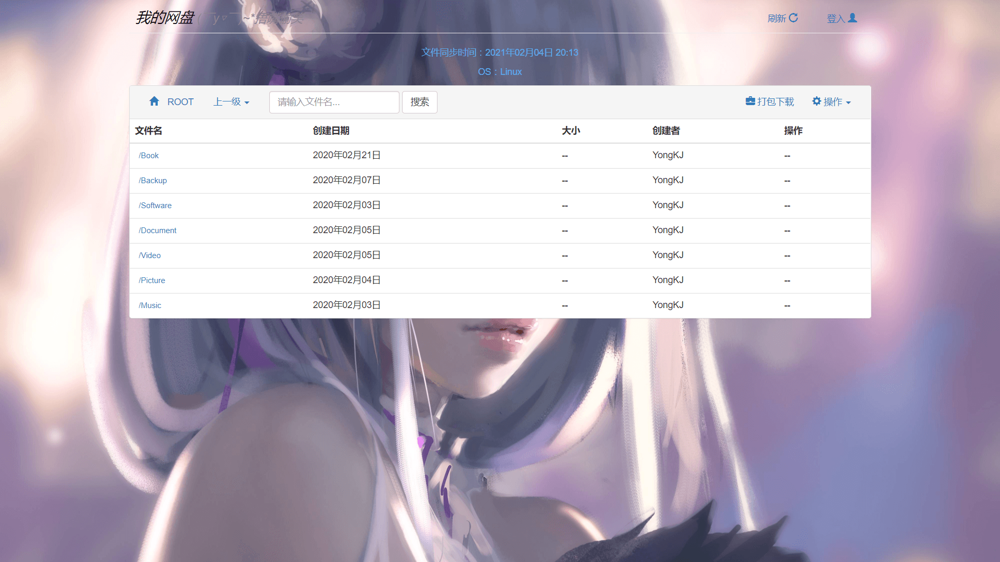

# 软件俱乐部

#### 介绍
本项目主要实现一个简洁、大方的博客网站，旨在挖掘、记录大学期间遇到的方便实用以及好玩有趣的软件。主要功能包括登录注册、文章评论 / 分类 / 搜索、RSS订阅、网盘下载、Android 客户端等。

#### 链接
软件俱乐部：[http://software.yongkj.cn/software/](http://software.yongkj.cn/software/)

#### 截图

#### 技术栈
MySQL+Servlet+JDBC+JSP+HTML+CSS+JS+Bootstrap4

1.  网站采用B/S即浏览器/服务器结构，同时也采用了MVC设计规范
2.  前端的页面展示运用了Boostrap4框架以及jQuery框架
3.  后端的数据处理采用Java Web中的Servlet容器技术完成
4.  使用 PreparedStatement 拼接条件查询语句防止 SQL 注入
5.  采用 RSS 聚合框架 Rome 来完成文章的 RSS 订阅功能
6.  通过搭建开源的私有网盘系统 Kiftd 提供软件的网盘下载功能
7.  利用 FusionApp 的 UI 模板将网页转换成应用，生成 Android 客户端
8.  拥有后台管理系统，实现文章发布、评论审核等功能
9.  后台的数据存储主要采用开源的Mariadb数据库来完成

#### 功能特性

1. 浏览和评论已经发表的文章，其中只有登录的用户才能留下发表的评论，游客发表的评论不会记录下来
2. 文章采用瀑布流式布局，并根据发表时间降序显示，简洁大方，具备响应式，轻松浏览最近发表的新文章
3. 分类浏览文章，其中文章分为三个类别，分别是Windows软件、Android软件和Linux软件
4. RSS文章订阅功能，即使不访问网站也能浏览最新发表的文章，界面很清爽，十分适合阅读
5. 更有网盘下载功能，可以下载一些开源软件，采用开源的Kiftd搭建的个人网盘，简单实用，方便快捷
6. 用户注册和登录，用户注册很简单，但是用户登录就要输入验证码，并且验证码对大小写敏感
7. 还有后台管理功能，轻松管理整个网站，分别有用户管理，评论管理，文章管理，图片管理，分类管理
8. 除此之外，还专门为本网站做了一个简单Android客户端，大大提升了浏览体验，做到随时随地浏览

#### 使用说明

1.  software.sql 为数据库备份文件
2.  可在 WEB-INF/src/dao/SQLUtil.java 文件中修改数据库连接信息
3.  所有逻辑代码均在 WEB-INF/src/service/ 文件夹下
4.  如需正常部署访问，则要修改 jsp 文件以及逻辑代码中的一些链接域名

> 此项目是在 Linux 环境下使用 Jupyter Lab 代码编辑器开发，因此可直接部署在 Tomcat 中的 webapps 文件夹下，并且需要手动输入命令编译项目代码文件（进入 WEB-INF/src 文件夹后输入 javac -d ../classes/ -cp ../../../../lib/*:../lib/*:controller/:service/:dao/:entity/ controller/CentralController.java）。
