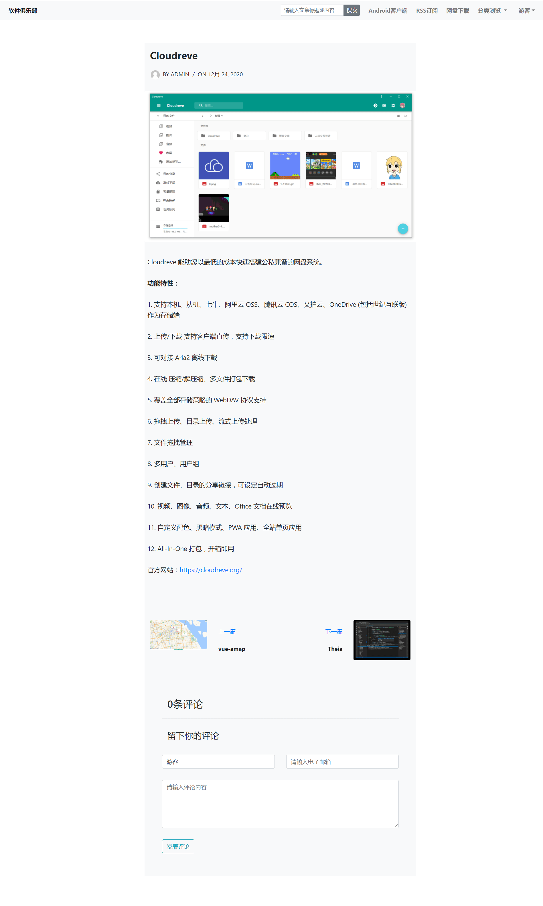

# 软件俱乐部

#### 介绍
本项目主要实现一个简洁、大方的博客网站，旨在挖掘、记录大学期间遇到的方便实用以及好玩有趣的软件。主要功能包括登录注册、文章评论 / 分类 / 搜索、RSS订阅、网盘下载、Android 客户端等。

#### 项目链接
软件俱乐部：[http://software.yongkj.cn/software/](http://software.yongkj.cn/software/)

#### 截图

#### 技术栈
MySQL+Servlet+JDBC+JSP+HTML+CSS+JS+Bootstrap4

#### 功能特性

1.  使用 PreparedStatement 拼接条件查询语句防止 SQL 注入
2.  采用 RSS 聚合框架 Rome 来完成文章的 RSS 订阅功能
3.  通过搭建开源的私有网盘系统 Kiftd 提供软件的网盘下载功能
4.  利用 FusionApp 的 UI 模板将网页转换成应用，生成 Android 客户端
5.  拥有后台管理系统，实现文章发布、评论审核等功能

#### 使用说明

1.  software.sql 为数据库备份文件
2.  可在 WEB-INF/src/dao/SQLUtil.java 文件中修改数据库连接信息
3.  所有逻辑代码均在 WEB-INF/src/service/ 文件夹下
4.  如需正常部署访问，则要修改 jsp 文件以及逻辑代码中的一些链接域名

> 此项目是在 Linux 环境下使用 Jupyter Lab 代码编辑器开发，
> 因此可直接部署在 Tomcat 中的 webapps 文件夹下，并且需要
> 手动输入命令编译项目代码文件（进入 WEB-INF/src 文件夹后
> 输入 javac -d ../classes/ -cp ../../../../lib/*:../lib/*:controller/:service/:dao/:entity/ controller/CentralController.java）。
